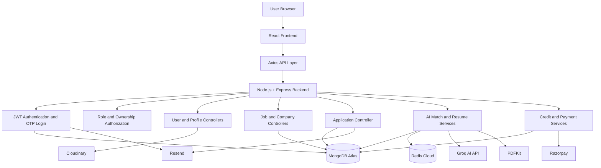
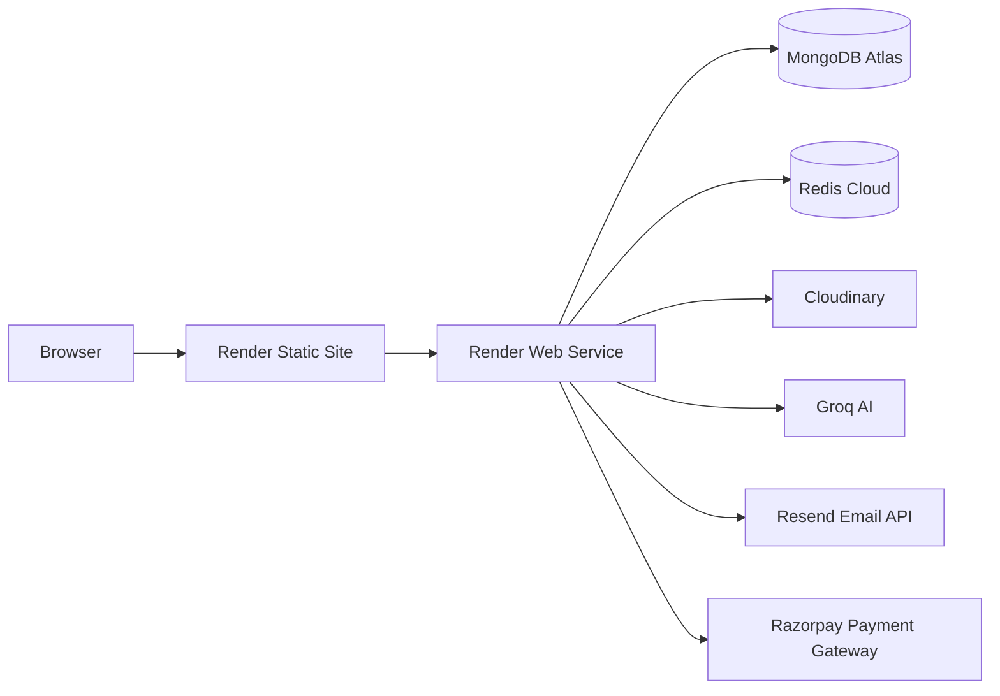

# JobSync — AI-Powered Recruitment & Career Intelligence Platform

<p align="center">
  <strong>A full-stack recruitment platform that connects job seekers and recruiters while using AI for job matching, skill-gap analysis, interview preparation, and ATS resume generation.</strong>
</p>

<p align="center">
  <a href="https://jobsync-client.onrender.com">
    
  </a>
  <a href="https://github.com/PULAK04/JobSync">
    
  </a>
</p>

---

## Live Application

- **Frontend:** [https://jobsync-client.onrender.com](https://jobsync-client.onrender.com)
- **Repository:** [https://github.com/PULAK04/JobSync](https://github.com/PULAK04/JobSync)

> The frontend is deployed as a Render Static Site. The backend is deployed separately as a Render Web Service.

---

## Overview

**JobSync** is an AI-powered recruitment and career intelligence platform built using the MERN stack.

The platform provides separate workflows for:

- Job seekers searching and applying for jobs
- Recruiters managing companies, jobs, and applicants
- AI-powered resume and job-description analysis
- Credit-based AI Match usage
- Razorpay-based credit purchases
- Password-based and OTP-based authentication
- ATS-optimized resume generation
- Application-status email notifications

The application combines traditional recruitment workflows with generative AI, Redis caching, secure authentication, payment verification, cloud file storage, and containerized development.

---

## Key Features

### Job Seeker Features

- User registration
- Email and password login
- Optional passwordless login using email OTP
- Secure JWT authentication using HTTP-only cookies
- Profile creation and update
- Resume upload using Cloudinary
- Resume download as a PDF attachment
- Browse available jobs
- Search jobs using keywords
- Filter jobs by location
- Filter jobs by job type
- Filter jobs by experience level
- Filter jobs by salary range
- Sort jobs by date, salary, or experience
- View complete job descriptions
- Apply for jobs
- Save jobs for later
- View previously applied jobs
- Generate AI Match Reports
- View previously generated AI reports
- Download AI-generated ATS resumes
- View current AI credit balance
- Purchase additional AI credits using Razorpay

### Recruiter Features

- Recruiter registration and login
- Create and manage company profiles
- Upload company logos
- Post new jobs
- View recruiter-posted jobs
- View applicants for each job
- View applicant profile information
- Download applicant resumes directly
- Accept job applications
- Reject job applications
- Send automated application-status emails using Resend
- Role-based and ownership-based authorization

### Authentication Features

JobSync provides two independent login methods.

#### Email and Password Login

Users can sign in directly using:

```text
Email
+
Password
```

No OTP is required for normal password-based login.

#### Login with OTP

Users who do not want to enter a password can select the OTP login option.

```text
Enter email
        ↓
Request OTP
        ↓
Receive OTP through Resend
        ↓
Verify OTP
        ↓
Login successfully
```

OTP login is optional and does not replace normal password login.

---

## AI-Powered Features

JobSync uses **Groq AI** to generate structured career and recruitment insights.

### AI Job Match Report

The AI Match system analyzes:

- Candidate resume
- Candidate profile description
- Job title
- Job description
- Required skills
- Candidate skills and experience

It generates:

- Overall job-match score
- Matching strengths
- Skill gaps
- Missing technologies
- Technical interview questions
- Behavioral interview questions
- Personalized preparation roadmap
- Career improvement recommendations

### ATS Resume Generation

The platform generates job-specific resume content using Groq AI.

The generated content includes:

- Professional title
- Contact information
- Professional summary
- Skills
- Education
- Projects
- Experience
- Achievements
- Certifications

The structured AI output is converted into a downloadable PDF using **PDFKit**.

---

## AI Credit System

JobSync uses a prepaid credit system for AI Match generation.

### Credit Rules

- New job seekers receive free AI credits.
- One credit is deducted when a new AI Match Report is generated.
- Viewing an existing report does not consume additional credits.
- Returning a cached report does not consume additional credits.
- Downloading an existing AI-generated resume does not consume additional credits.
- Credits are refunded if AI generation fails after a deduction.
- Users with zero credits cannot generate a new AI Match Report.

### Insufficient Credit Flow

```text
User clicks AI Match
        ↓
Backend checks available credits
        ↓
Credits are zero
        ↓
AI request is blocked
        ↓
Frontend displays an insufficient-credit message
        ↓
User is redirected to the credit purchase page
```

The backend is the source of truth for credit balances. Frontend credit checks are used only for user experience.

---

## Razorpay Payment Integration

Razorpay is integrated for purchasing AI credit packs.

### Payment Flow

```text
User selects a credit plan
        ↓
Frontend sends only the selected plan ID
        ↓
Backend validates the plan
        ↓
Backend creates a Razorpay order
        ↓
Razorpay Checkout opens
        ↓
User completes payment
        ↓
Frontend sends payment details to backend
        ↓
Backend verifies Razorpay signature
        ↓
Backend verifies payment status
        ↓
Payment record is marked as paid
        ↓
Credits are added to the user account
```

### Payment Security

- Prices are controlled by the backend.
- Credit quantities are controlled by the backend.
- The frontend never decides the payment amount.
- Razorpay signatures are verified on the backend.
- Razorpay secrets are never exposed to the frontend.
- Duplicate payment processing is prevented.
- Credits are added only after successful verification.

> The current implementation uses backend verification after Razorpay Checkout and does not use Razorpay webhooks.

---

## Redis Caching

Redis is used to reduce repeated database queries and expensive AI operations.

### Redis Use Cases

- Caching generated AI Match Reports
- Caching user report history
- Caching generated resume PDFs
- Reducing repeated Groq API calls
- Reducing repeated MongoDB queries
- Improving repeated report and download response times

### Example Redis Keys

```text
report:userId:reportFingerprint
history:userId
resume-pdf:userId:interviewReportId
```

### Cache Behaviour

```text
AI Match request
        ↓
Check Redis cache
        ↓
Cache hit?
   ├── Yes → Return cached report without deducting credit
   └── No  → Reserve credit and generate a new report
```

Redis failures are handled gracefully so that temporary cache unavailability does not completely break the core application.

---

## Resume Upload and Download Flow

### Resume Upload

```text
User selects PDF resume
        ↓
Frontend sends multipart request
        ↓
Multer validates the file
        ↓
Backend checks file type and size
        ↓
Resume is uploaded to Cloudinary
        ↓
Cloudinary URL is stored in MongoDB
```

### Resume Download

```text
User or recruiter clicks Download Resume
        ↓
Authenticated request is sent to backend
        ↓
Backend checks authorization
        ↓
Backend fetches the resume from Cloudinary
        ↓
Backend returns it with attachment headers
        ↓
Browser downloads the PDF
```

The application does not directly open the Cloudinary resume URL in a new tab.

---

## Application Status Workflow

```text
Job seeker applies for a job
        ↓
Application is stored in MongoDB
        ↓
Recruiter opens the applicant dashboard
        ↓
Recruiter accepts or rejects the application
        ↓
Backend verifies recruiter ownership
        ↓
Application status is updated
        ↓
Resend sends a status email to the candidate
```

---

## System Architecture



---

## Deployment Architecture



### Production Services

| Application Component | Deployment Service |
|---|---|
| React frontend | Render Static Site |
| Express backend | Render Web Service |
| Database | MongoDB Atlas |
| Cache | Redis Cloud |
| Resume and image storage | Cloudinary |
| AI generation | Groq |
| Email delivery | Resend |
| Payment gateway | Razorpay |

---

## Tech Stack

### Frontend

- React.js
- Vite
- Redux Toolkit
- Redux Persist
- React Router DOM
- Tailwind CSS
- Axios
- Framer Motion
- React Icons
- React Hot Toast

### Backend

- Node.js
- Express.js
- MongoDB
- Mongoose
- JWT
- Cookie Parser
- Multer
- PDFKit
- Axios
- Zod
- Helmet
- Compression
- Express Rate Limit

### AI and Document Processing

- Groq AI API
- Structured JSON generation
- PDF.js
- PDFKit

### Payments and Credits

- Razorpay
- Backend order creation
- Server-side signature verification
- Credit transaction management
- Duplicate payment protection

### Email and Authentication

- Resend
- Email OTP login
- Password-based login
- JWT HTTP-only cookies
- Secure cross-origin cookie configuration

### Database, Cache and Storage

- MongoDB Atlas
- Redis Cloud
- ioredis
- Cloudinary

### DevOps and Deployment

- Docker
- Docker Compose
- Nginx
- Render Web Services
- Render Static Sites
- GitHub Actions
- Git
- GitHub

---

## Security Features

- Password hashing
- JWT authentication
- HTTP-only authentication cookies
- Secure production cookies
- Optional OTP-based login
- OTP expiration
- OTP attempt limits
- Role-based access control
- Recruiter ownership checks
- Object-level authorization
- Backend-controlled payment plans
- Razorpay signature verification
- Atomic AI credit deduction
- Duplicate application prevention
- Duplicate payment prevention
- File-size restrictions
- File-type validation
- Cloudinary URL validation
- API rate limiting
- Request validation using Zod
- Security headers using Helmet
- Global error-handling middleware
- Restricted CORS origins
- Environment-variable-based secrets

---

## Database Design

### Main Collections

```text
Users
Companies
Jobs
Applications
InterviewReports
Payments
CreditTransactions
```

### User Data

A user document stores:

- Full name
- Email
- Hashed password
- Role
- Profile information
- Resume information
- Skills
- AI credit balance
- OTP verification information

### Application Data

An application connects:

```text
Applicant
+
Job
+
Application status
```

A compound database index prevents the same user from applying for the same job multiple times.

### Payment Data

A payment record stores:

- User
- Plan ID
- Credit quantity
- Amount
- Currency
- Razorpay order ID
- Razorpay payment ID
- Payment status
- Credit processing status

---

## Project Structure

```text
JobSync/
│
├── .github/
│   └── workflows/
│       └── ci.yml
│
├── backend/
│   ├── config/
│   ├── constants/
│   ├── controllers/
│   ├── middlewares/
│   ├── models/
│   ├── routes/
│   ├── services/
│   ├── utils/
│   ├── validators/
│   ├── .dockerignore
│   ├── Dockerfile
│   ├── index.js
│   ├── package.json
│   └── package-lock.json
│
├── frontend/
│   ├── public/
│   ├── src/
│   │   ├── admin/
│   │   ├── components/
│   │   ├── hooks/
│   │   ├── interview/
│   │   ├── pages/
│   │   ├── redux/
│   │   ├── utils/
│   │   ├── App.jsx
│   │   └── main.jsx
│   ├── .dockerignore
│   ├── Dockerfile
│   ├── nginx.conf
│   ├── package.json
│   └── package-lock.json
│
├── compose.yaml
├── .gitignore
└── README.md
```

---

## Core Backend Modules

### Authentication Module

Handles:

- Registration
- Email and password login
- OTP request
- OTP verification
- Logout
- Current-user authentication
- JWT cookie creation and removal

### User Module

Handles:

- User profiles
- Profile updates
- Resume uploads
- Resume downloads
- Skills and bio management

### Job Module

Handles:

- Job creation
- Job listing
- Job searching
- Filtering
- Sorting
- Recruiter-specific job retrieval
- Job detail retrieval

### Company Module

Handles:

- Company registration
- Company updates
- Company details
- Company logo uploads

### Application Module

Handles:

- Job applications
- Applied-job history
- Applicant retrieval
- Resume access
- Application status updates
- Candidate notification emails

### AI Module

Handles:

- Resume extraction
- AI Match generation
- Skill-gap analysis
- Interview question generation
- Preparation roadmap generation
- ATS resume generation
- PDF creation
- Redis caching
- Credit deduction and refunds

### Payment Module

Handles:

- Credit plan retrieval
- Razorpay order creation
- Payment verification
- Credit addition
- Payment history
- Duplicate processing prevention

---

## Local Development with Docker

### Prerequisites

- Docker Desktop
- Groq API key
- Cloudinary account
- Redis Cloud account or Docker Redis service
- MongoDB Atlas account or Docker MongoDB service
- Resend API key
- Razorpay Test Mode keys

### Configure Environment Variables

Create or update:

```text
backend/.env
frontend/.env
```

### Backend Environment Variables

```env
NODE_ENV=development
PORT=8000

MONGO_URI=mongodb://localhost:27017/jobsync
REDIS_URL=redis://localhost:6379

JWT_SECRET=replace_with_a_long_random_secret
JWT_EXPIRES_IN=1d

OTP_TOKEN_SECRET=replace_with_another_long_random_secret
OTP_PEPPER=replace_with_another_secure_random_value
OTP_EXPIRY_MINUTES=10
OTP_MAX_ATTEMPTS=5
DEV_SHOW_OTP=false

FREE_AI_CREDITS=5
AI_MATCH_CREDIT_COST=1

FRONTEND_URLS=http://localhost:5173
COOKIE_SECURE=false
COOKIE_SAME_SITE=lax

CLOUD_NAME=your_cloudinary_cloud_name
API_KEY=your_cloudinary_api_key
API_SECRET=your_cloudinary_api_secret

GROQ_API_KEY=your_groq_api_key
GROQ_MODEL=openai/gpt-oss-120b

RESEND_API_KEY=your_resend_api_key
RESEND_FROM=JobSync <onboarding@resend.dev>

RAZORPAY_KEY_ID=rzp_test_your_key_id
RAZORPAY_KEY_SECRET=your_razorpay_test_secret
```

### Frontend Environment Variables

For local Vite or Docker development:

```env
VITE_BACKEND_URL=
```

When this value is empty, frontend requests use relative `/api` routes and are proxied to the backend.

For separately hosted frontend and backend services:

```env
VITE_BACKEND_URL=https://your-backend-service.onrender.com
```

---

## Run with Docker

From the project root:

```bash
docker compose up --build
```

Open:

```text
Frontend: http://localhost:5173
Backend:  http://localhost:8000
Health:   http://localhost:8000/health
```

Run in the background:

```bash
docker compose up -d
```

Check services:

```bash
docker compose ps
```

View backend logs:

```bash
docker compose logs -f backend
```

Stop services:

```bash
docker compose down
```

Delete containers and local database volumes:

```bash
docker compose down -v
```

> The `-v` option permanently removes local MongoDB and Redis volume data.

---

## Run Without Docker

### Backend

```bash
cd backend
npm install
npm run dev
```

### Frontend

Open another terminal:

```bash
cd frontend
npm install
npm run dev
```

MongoDB and Redis must already be running or replaced with cloud connection URLs.

---

## Docker Architecture

```text
Browser
   │
   ▼
Frontend Container
React production build served by Nginx
   │
   ▼
Backend Container
Node.js + Express
   │
   ├── MongoDB Container / MongoDB Atlas
   ├── Redis Container / Redis Cloud
   ├── Cloudinary
   ├── Groq
   ├── Resend
   └── Razorpay
```

The frontend uses a multi-stage Docker build:

```text
Node.js build stage
        ↓
Vite creates production files
        ↓
Nginx serves the generated dist directory
```

---

## GitHub Actions CI

The project includes a GitHub Actions workflow that runs on:

- Pushes to the `main` branch
- Pull requests targeting the `main` branch

### CI Pipeline

```text
Checkout repository
        ↓
Set up Node.js
        ↓
Install backend dependencies
        ↓
Validate backend JavaScript syntax
        ↓
Install frontend dependencies
        ↓
Build React frontend
        ↓
Build backend Docker image
        ↓
Build frontend Docker image
```

The syntax validation excludes third-party files inside `node_modules`.

---

## Deployment

### Frontend Deployment

The frontend is deployed as a Render Static Site.

```text
Root Directory: frontend
Build Command: npm install && npm run build
Publish Directory: dist
```

Frontend environment variable:

```env
VITE_BACKEND_URL=https://your-backend-service.onrender.com
```

React Router rewrite:

```text
Source: /*
Destination: /index.html
Action: Rewrite
```

### Backend Deployment

The backend is deployed as a Render Web Service.

```text
Root Directory: backend
Build Command: npm install
Start Command: npm start
Health Check Path: /health
```

Production cookie configuration:

```env
COOKIE_SECURE=true
COOKIE_SAME_SITE=none
```

Production frontend origin:

```env
FRONTEND_URLS=https://jobsync-client.onrender.com
```

### Production Database and Cache

Use:

```env
MONGO_URI=mongodb+srv://...
REDIS_URL=rediss://...
```

Do not use Docker-only service names on Render:

```env
MONGO_URI=mongodb://mongo:27017/jobsync
REDIS_URL=redis://redis:6379
```

---

## Important Production Notes

- Cloudinary PDF delivery must be enabled for resume downloads and AI resume parsing.
- Resend's test sender may only deliver emails to the address connected to the Resend account.
- A verified domain is required for general production email delivery.
- Razorpay Test Mode should be used while testing the credit purchase flow.
- Razorpay Live Mode requires account activation and production credentials.
- Render Free services may experience cold starts after inactivity.
- Real environment variables must never be committed to GitHub.
- MongoDB Atlas should allow the backend service's outbound IP addresses.
- Redis Cloud should use TLS when required by the provider.

---

## Current Limitations

- Razorpay webhooks are not used in the current implementation.
- Payment verification depends on the client returning payment details to the backend after Checkout.
- Resend test sender restrictions apply until a custom domain is verified.
- Free Render services may sleep when inactive.
- AI output quality depends on resume quality, job-description detail, model availability, and API limits.

---

## Future Improvements

- Razorpay webhook integration
- Verified email domain
- Recruiter analytics dashboard
- Application-status timeline
- Interview scheduling
- In-app notification centre
- Real-time recruiter and candidate chat
- Editable AI-generated resume preview
- AI report regeneration controls
- Advanced job recommendations
- Admin dashboard
- Automated unit and integration tests
- End-to-end testing
- Centralized logging and monitoring
- Payment invoices and refund handling
- Subscription-based premium plans

---

## Development Principles

The project follows these engineering principles:

- Backend-controlled authorization
- Backend-controlled credit balances
- Backend-controlled payment amounts
- Secure HTTP-only authentication
- Input validation before database operations
- Cache-aside pattern for AI reports
- Atomic credit deduction
- External managed storage for uploaded files
- Environment-based configuration
- Separation between frontend, backend, database, AI, email, and payment services

---

## Author

**Pulak**

- GitHub: [PULAK04](https://github.com/PULAK04)
- Institution: NIT Jamshedpur
- Areas of Interest:
  - Full-Stack Development
  - Backend Engineering
  - Generative AI Integration
  - Data Structures and Algorithms
  - Cloud Deployment
  - System Design

---

## License

This project is created for educational, portfolio, and placement-preparation purposes.

All third-party services, libraries, trademarks, and APIs belong to their respective owners.