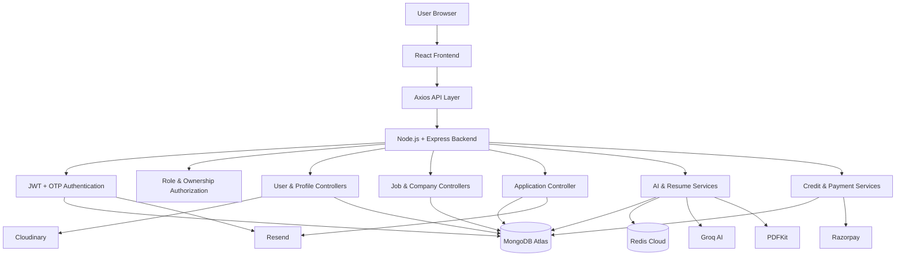

# 🚀 JobSync — AI-Powered Recruitment & Career Intelligence Platform

<p align="center">
  <strong>Full-stack recruitment platform connecting job seekers and recruiters with AI-powered job matching, interview preparation, skill-gap analysis, and ATS resume generation.</strong>
</p>

<p align="center">
  <a href="https://jobsync-client.onrender.com">
    
  </a>
  <a href="https://github.com/PULAK04/JobSync">
    
  </a>
</p>

<p align="center">
  
  
  
  
  
  
  
  
</p>

---

## 🌐 Live

**Frontend:** https://jobsync-client.onrender.com
**GitHub:** https://github.com/PULAK04/JobSync

---

## ✨ Features

### 👨‍💻 Job Seekers

* Registration and login with **email/password**
* Optional **passwordless OTP login**
* JWT authentication using HTTP-only cookies
* Profile and resume management
* Resume upload/download with Cloudinary
* Job search, filtering, sorting and pagination
* Job applications and saved jobs
* AI Match Reports
* Technical and behavioral interview questions
* Personalized preparation plan
* ATS-optimized AI resume generation
* AI credit balance and credit purchases

### 🏢 Recruiters

* Recruiter registration and login
* Company creation and management
* Job posting and management
* Applicant tracking
* Applicant resume download
* Accept/reject applications
* Automated application-status emails
* Role and ownership-based authorization

### 🤖 AI

* Job match score
* Skill-gap analysis
* Technical interview questions
* Behavioral interview questions
* Personalized preparation roadmap
* ATS resume generation using Groq AI

---

## 🏗️ Architecture



---

## 🔄 Core Workflows

### AI Match

```text
User selects job
      ↓
Frontend sends job + candidate data
      ↓
Backend checks AI credits
      ↓
Check Redis cache
      ↓
Cache hit → return existing report
      ↓
Cache miss → deduct credit
      ↓
Resume extraction
      ↓
Groq AI analysis
      ↓
Generate match score + skill gaps
      ↓
Generate interview questions + roadmap
      ↓
Save report in MongoDB
      ↓
Cache report in Redis
      ↓
Return report to frontend
```

### Resume Generation

```text
Resume + Job Description
          ↓
        Groq AI
          ↓
Structured resume data
          ↓
        PDFKit
          ↓
Generated ATS Resume PDF
```

### Credit & Payment

```text
User selects credit plan
        ↓
Backend validates plan
        ↓
Create Razorpay order
        ↓
Razorpay Checkout
        ↓
Payment completed
        ↓
Backend verifies signature/status
        ↓
Payment marked as paid
        ↓
Credits added
```

### Application Status

```text
Job Seeker applies
      ↓
Application stored
      ↓
Recruiter reviews applicant
      ↓
Accept / Reject
      ↓
Backend verifies ownership
      ↓
Application status updated
      ↓
Resend sends email notification
```

---

## 🧰 Tech Stack

### Frontend

* React.js
* Vite
* Redux Toolkit
* Redux Persist
* React Router
* Tailwind CSS
* Axios
* Framer Motion

### Backend

* Node.js
* Express.js
* MongoDB
* Mongoose
* JWT
* Multer
* Zod
* Helmet
* Compression
* Express Rate Limit

### AI & Documents

* Groq AI
* PDF.js
* PDFKit

### Database & Storage

* MongoDB Atlas
* Redis Cloud
* Cloudinary

### Authentication & Email

* JWT HTTP-only cookies
* Email/password authentication
* Email OTP authentication
* Resend

### Payments

* Razorpay
* Server-side signature verification
* Credit transaction management

### DevOps

* Docker
* Docker Compose
* Nginx
* GitHub Actions
* Render

---

## 🗄️ Database

Main collections:

```text
Users
Companies
Jobs
Applications
InterviewReports
Payments
CreditTransactions
```

Important relationships:

```text
User
 ├── Profile
 ├── Resume
 ├── AI Credits
 └── Applications

Company
 └── Jobs

Job
 └── Applications

User + Job
 └── Interview Report
```

A compound database constraint prevents duplicate applications for the same job.

---

## 🔐 Security

* bcrypt password hashing
* JWT authentication
* HTTP-only cookies
* Secure production cookies
* OTP expiry and attempt limits
* Role-based authorization
* Recruiter ownership checks
* Zod request validation
* API rate limiting
* Helmet security headers
* File type and size validation
* Backend-controlled payment amounts
* Razorpay signature verification
* Backend-controlled AI credits
* Environment-based secrets

---

## 🐳 Run with Docker

### Prerequisites

* Docker Desktop
* MongoDB / MongoDB Atlas
* Redis / Redis Cloud
* Groq API key
* Cloudinary account
* Resend API key
* Razorpay test credentials

### Configure

```text
backend/.env
frontend/.env
```

### Start

```bash
docker compose up --build
```

### Services

```text
Frontend → http://localhost:5173
Backend  → http://localhost:8000
Health   → http://localhost:8000/health
```

### Stop

```bash
docker compose down
```

---

## 🚀 Deployment

```text
Browser
   ↓
Render Static Site
   ↓
Render Web Service
   ↓
MongoDB Atlas
Redis Cloud
Cloudinary
Groq AI
Resend
Razorpay
```

### Production

* Frontend → Render Static Site
* Backend → Render Web Service
* Database → MongoDB Atlas
* Cache → Redis Cloud
* File Storage → Cloudinary
* AI → Groq
* Email → Resend
* Payments → Razorpay

---

## 📁 Project Structure

```text
JobSync/
│
├── .github/
│   └── workflows/
│       └── ci.yml
│
├── backend/
│   ├── config/
│   ├── constants/
│   ├── controllers/
│   ├── middlewares/
│   ├── models/
│   ├── routes/
│   ├── services/
│   ├── utils/
│   ├── validators/
│   ├── Dockerfile
│   └── index.js
│
├── frontend/
│   ├── public/
│   ├── src/
│   ├── Dockerfile
│   ├── nginx.conf
│   └── package.json
│
├── compose.yaml
├── .gitignore
└── README.md
```

---

## 🔮 Future Improvements

* Razorpay webhooks
* Verified production email domain
* Recruiter analytics
* Interview scheduling
* In-app notifications
* Real-time chat
* Editable AI resume preview
* Advanced job recommendations
* Automated unit/integration/E2E testing
* Centralized monitoring and logging

---

## 👨‍💻 Author

**Shayan Adhikary**

* GitHub: https://github.com/PULAK04
* Institution: NIT Jamshedpur
* Full-Stack Development
* Backend Engineering
* Generative AI
* Data Structures & Algorithms
* Cloud Deployment

---

